# 🌊 深圳出发 | 香港秘境徒步：鹤咀螃蟹洞+龙脊线+石澳《喜剧之王》同款沙滩一日攻略

---

## 📸 **行程亮点**

- **鹤咀海岸保护区**：探秘天然「螃蟹洞」与「一线天」礁石（图2-5），打卡鲸鱼骨架地标（图6-7）🐋
- **龙脊线徒步**：登顶亚洲最佳城市远足径，俯瞰山海全景（图10轨迹）🌿
- **石澳沙滩**：重温《喜剧之王》经典场景（图1），漫步彩色渔村与情人桥💙
- **港式风情**：坐叮叮车、吃茶餐厅，体验港岛慢生活🍜

---

## 🚇 **路线规划**

**深圳福田口岸 ➔ 香港鹤咀村 ➔ 龙脊线 ➔ 石澳沙滩**

### **STEP 1：深圳到香港交通**

- **7:30 福田口岸集合**  
  兑换港币（口岸二楼有柜台）、购买1日流量卡（推荐支付宝“境外上网”10元/天）
- **过关后乘东铁线**：落马洲站→金钟站（约45分钟）
- **转港岛线到筲箕湾**：港岛线金钟→柴湾方向，筲箕湾站A2出口（约20分钟，地铁总计约50元人民币）
- **换乘巴士**：筲箕湾巴士总站乘双层巴士9路→ **鹤咀道站**（车程20分钟，八达通约9.4港币）

### **STEP 2：鹤咀海岸保护区（3小时）**

- **徒步路线**：鹤咀道站→鹤咀村→雷音洞（螃蟹洞）→ 一线天→ 灯塔→鲸鱼骨标本（图6-7）
  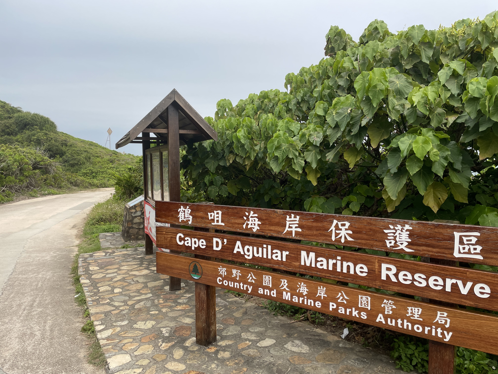  
  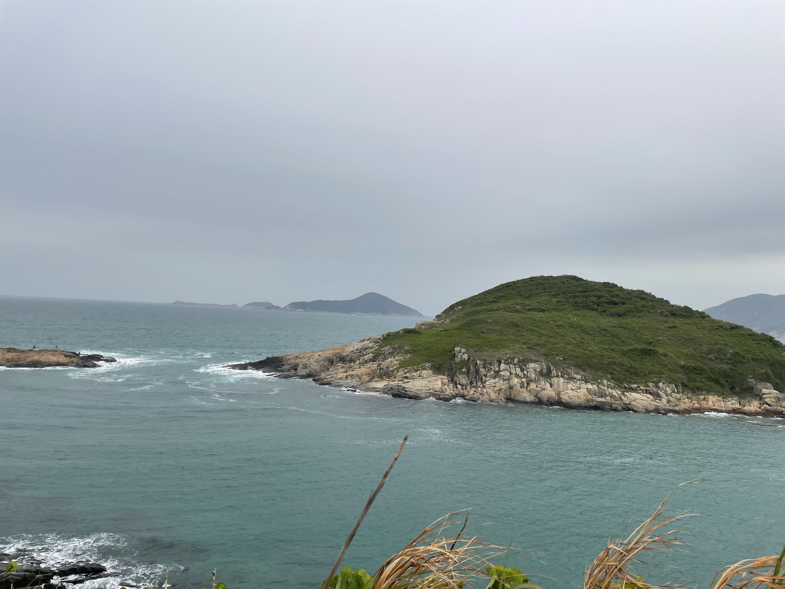
  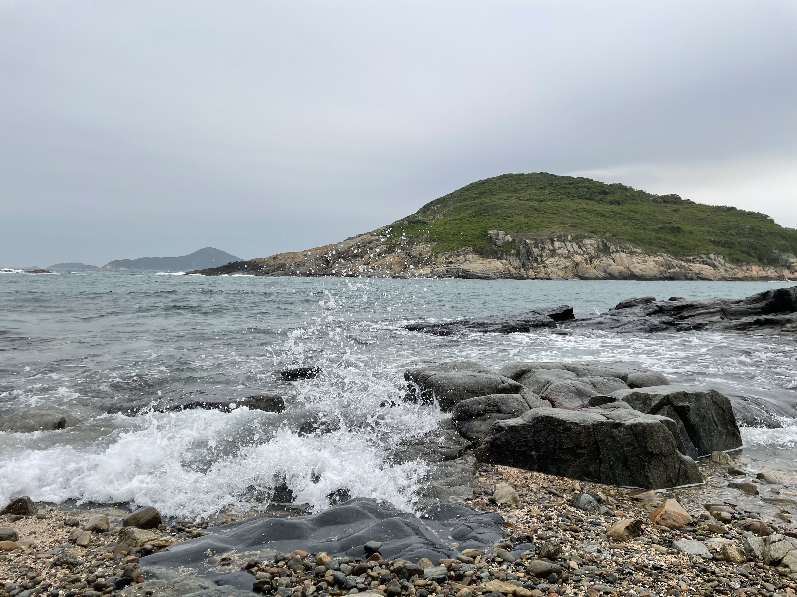
- **Tips**：礁石湿滑需防滑鞋！保护区禁止游泳，垃圾请带走📸

### **STEP 3：龙脊线徒步（4小时）**

- **交通**：鹤咀站搭新巴9路→ **土地湾站**（龙脊起点）
- **路线**：土地湾→打烂埕顶山（284米）→大浪湾（8.5KM，新手友好）
- 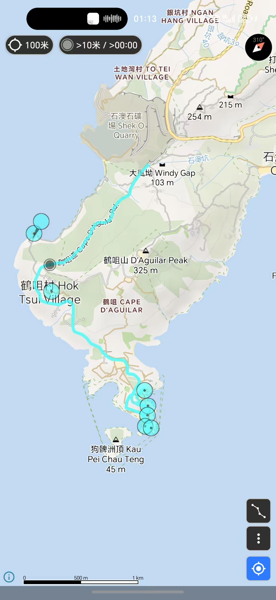
- **风景**：270°观海平台、悬崖机位（图10轨迹用「两步路户外助手」导航）

### **STEP 4：石澳沙滩日落（2小时）**

- **交通**：大浪湾乘小巴→石澳总站（10分钟）
- **玩法**：打卡《喜剧之王》同款树、彩色小屋（图1），沙滩踏浪🌅
  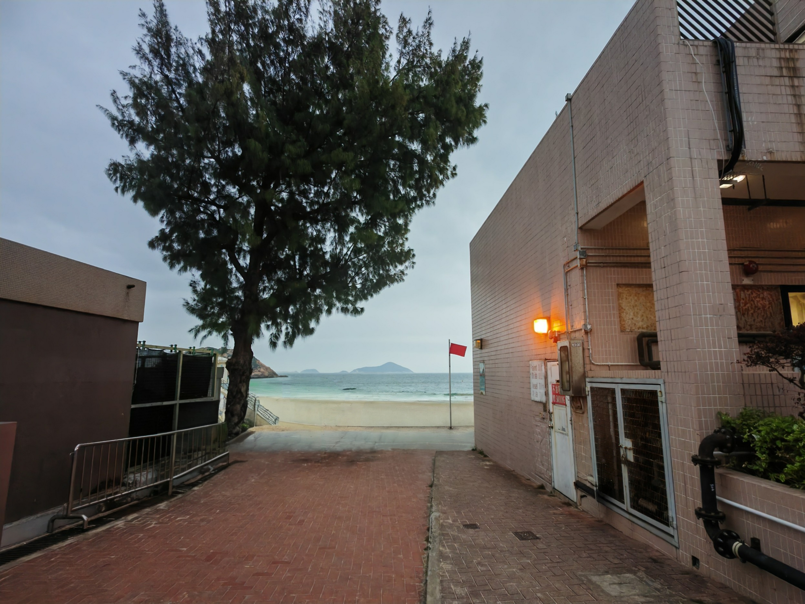
 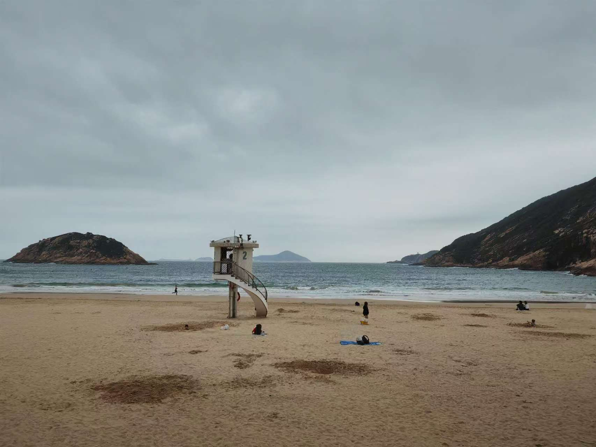
 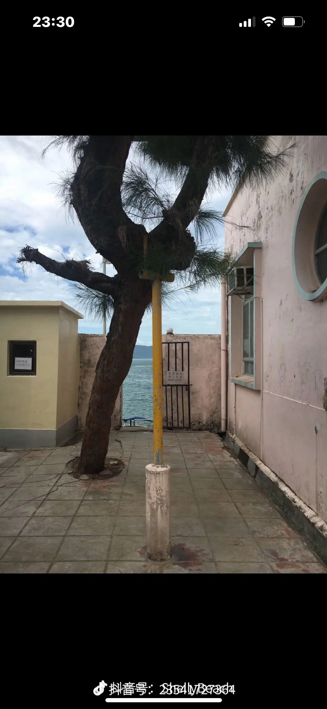

### **螃蟹洞拍照指南**
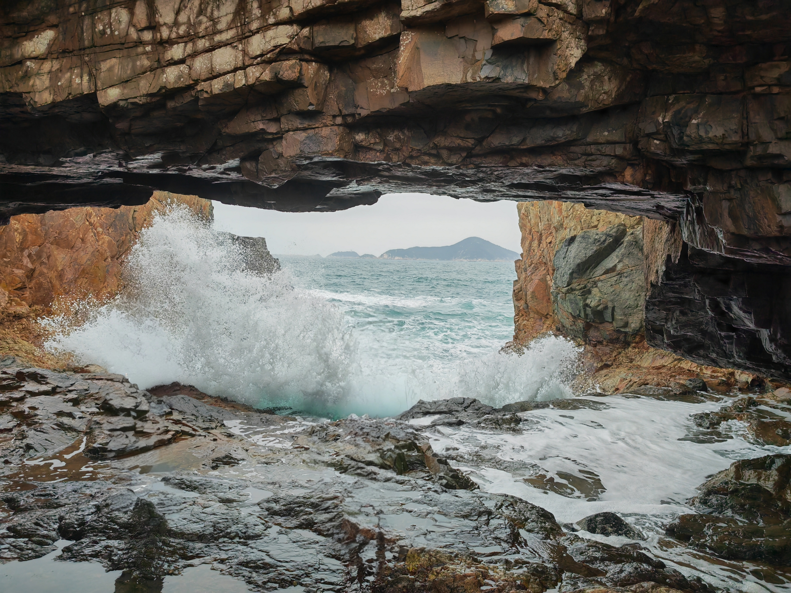
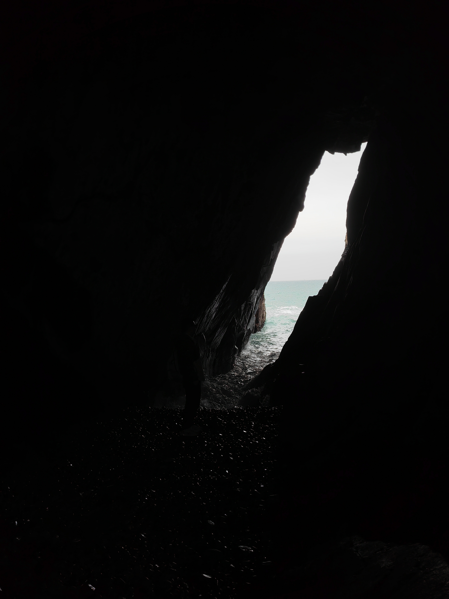

- **返程**：石澳乘新巴9路→筲箕湾站→金钟→福田口岸（末班车约21:30）

---

## 🎒 **行前准备**

| 物品     | 说明                                                              |
| -------- | ----------------------------------------------------------------- |
| **证件** | 港澳通行证+有效签注（提前办理！）                                 |
| **交通** | 八达通卡（口岸购买或手机绑定Apple Pay）                           |
| **导航** | 下载「两步路户外助手」（导入龙脊线轨迹）、「香港远足路线」官方APP |
| **装备** | 防滑徒步鞋、防晒帽、1L水、轻便背包、充电宝                        |
| **现金** | 人均200港币（部分小吃摊只收现金）                                 |

---

## 💡 **详细攻略**

### **螃蟹洞拍照指南**

- **最佳时间**：中午阳光直射洞内，海浪折射蓝光超梦幻（图3-4）
  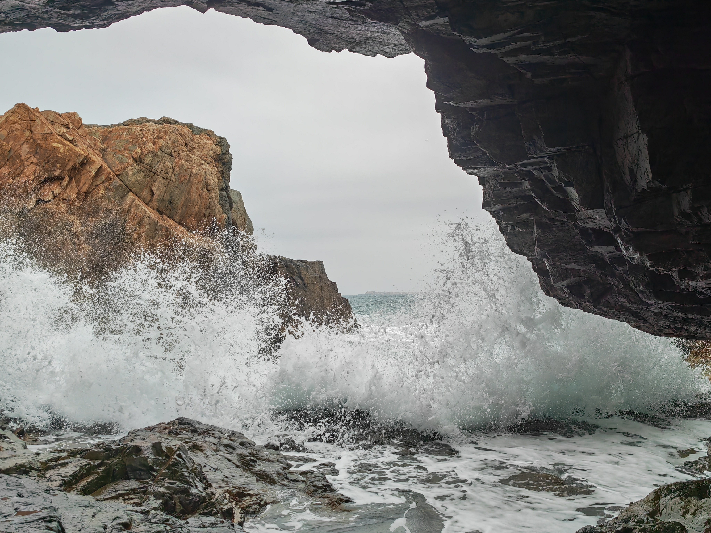
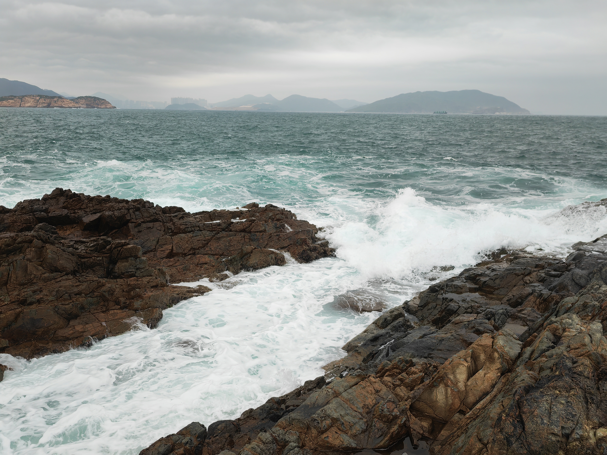
- **安全提示**！潮涨时洞口淹没，务必查看潮汐表（推荐APP「Tides」）

### **龙脊线隐藏机位**

- 打烂埕顶山观景台：用长焦拍石澳沙滩与海岬（图10标注点）
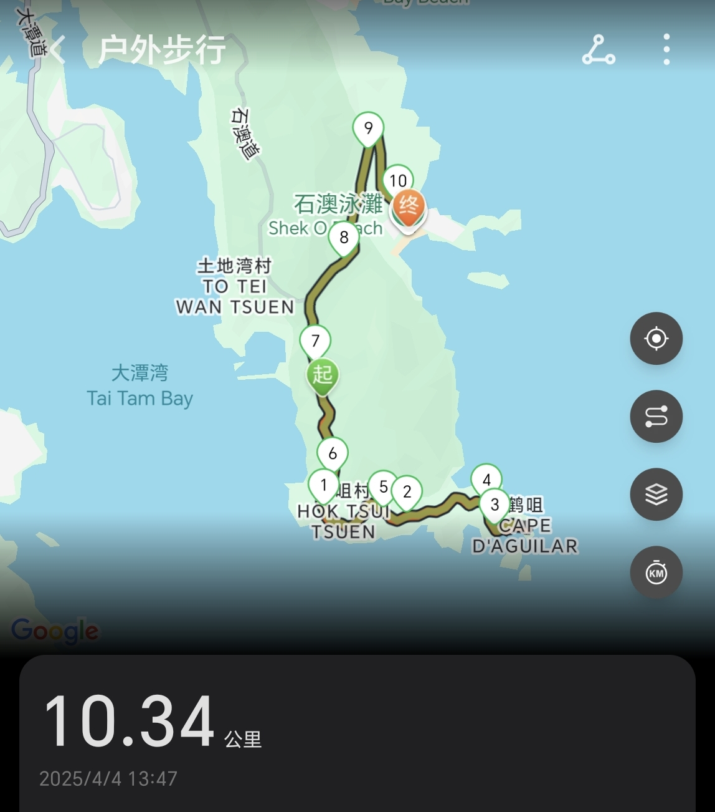
- 悬崖岩石区：坐姿背影+山海背景，氛围感拉满（需注意安全！）
  

### **石澳必吃美食**

- **沙爹牛肉公仔面**：石澳茶餐厅人均50港币
- **椰子雪糕**：村口士多店，清爽解暑🥥

---

## ⚠️ **注意事项**

1. 福田口岸过关时间约30分钟，建议工作日出行避开人流
2. 香港靠左行驶，过马路注意看车！
3. 徒步路线无补给点，自备干粮（推荐饭团、能量棒）
4. 保护环境！勿破坏礁石生态，垃圾随身带走🗑️

---

## 💰 **费用参考**

| 项目     | 费用（人均） |
| -------- | ------------ |
| 交通     | 150港币      |
| 餐饮     | 100港币      |
| 流量卡   | 10元         |
| **总计** | ≈260元       |

---

📢 **互动时间**  
“香港徒步的治愈，是山与海的双向奔赴。” 你去过香港哪些小众景点？评论区告诉我吧！👇  
（攻略有用记得❤️⭐️，关注我解锁更多深港澳玩法！）
